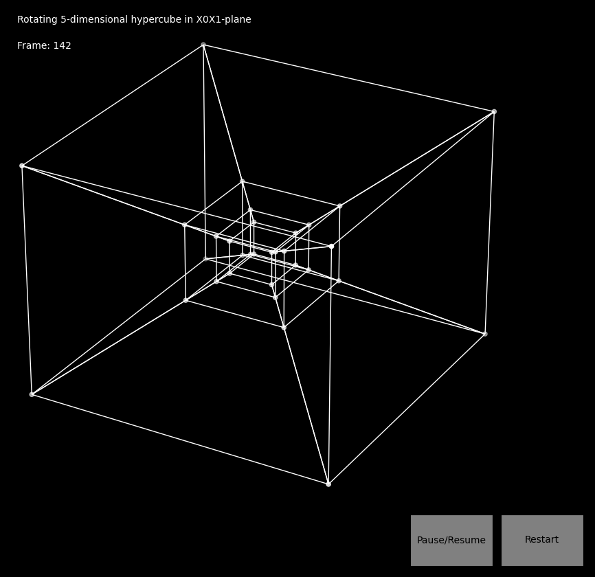

# n-dimensional Hypercube Visualization

This project provides a 3D visualization of an n-dimensional hypercube rotating through its various rotation planes. The dimension `n` is provided as a command-line argument (n ≥ 4). The visualization includes interactive controls for pausing, resuming, and restarting the animation.



## Features

- **Dynamic Visualization:** Visualize hypercubes in any dimension `n` (n ≥ 4).
- **Rotational Animation:** Rotates through all possible rotation planes in n dimensions.
- **Interactive Controls:**
  - **Pause/Resume:** Pause or resume the animation.
  - **Restart:** Restart the animation from the beginning.
  - **Mouse Interaction:** Rotate the 3D view using your mouse.
- **Perspective Projection:** Projects from nD to 3D for intuitive visualization.
- **Consistent Output Size:** Maintains consistent output size for visualization.

## Requirements

- **Python 3.8**
- **NumPy**
- **Matplotlib**

## Installation

1. **Clone the Repository**

   ```bash
   git clone https://github.com/EjayNg-AI/n-dim-hypercube.git
   cd hypercube-visualization
   ```

2. **Install Dependencies**

   Use `pip` to install the required Python packages:

   ```bash
   pip install -r requirements.txt
   ```

## Usage

Run the script with the desired dimension `n` (n ≥ 4):

```bash
python hypercube_visualization.py n
```

Replace `n` with the desired dimension.

### Examples

- **Visualize a 4D hypercube (tesseract):**

  ```bash
  python hypercube_visualization.py 4
  ```

- **Visualize a 5D hypercube (penteract):**

  ```bash
  python hypercube_visualization.py 5
  ```

- **Visualize a 6D hypercube:**

  ```bash
  python hypercube_visualization.py 6
  ```

## How It Works

### Overview

The script generates an n-dimensional hypercube (where `n` is specified by the user) and animates its rotation through all possible rotation planes, projecting it down to 3D for visualization.

### Steps Involved

1. **Vertex Generation:**
   - **Vertices:** All possible combinations of `-1` and `1` in `n` dimensions are generated, resulting in `2^n` vertices.
   - **Edges:** Edges are determined by connecting vertices that differ by exactly 2 units in one coordinate (i.e., they differ in exactly one dimension).

2. **Rotation:**
   - **Rotation Planes:** All possible pairs of axes in `n` dimensions are identified as rotation planes.
   - **Rotation Matrix:** For each rotation plane, a rotation matrix is constructed using trigonometric functions to rotate the hypercube around that plane.
   - **Animation:** The hypercube is rotated incrementally in each plane, and the frames are captured for animation.

3. **Projection:**
   - **nD to 3D Projection:** The high-dimensional hypercube is projected down to 3D using perspective projection.
   - **Iterative Projection:** Starting from the highest dimension beyond the third, the projection is performed iteratively by scaling the coordinates based on their respective dimensions.

4. **Visualization:**
   - **Matplotlib 3D Plotting:** The projected 3D vertices and edges are plotted using Matplotlib's 3D capabilities.
   - **Interactive Plot:** The plot is interactive, allowing the user to rotate the view with the mouse.

5. **Animation Management:**
   - **AnimationManager Class:** Manages the animation, handling the update of frames, pausing, resuming, and restarting.
   - **Controls:** Interactive buttons are provided for pausing/resuming and restarting the animation.

### Key Components

- **Functions:**
  - `generate_vertices(n)`: Generates the vertices of the hypercube.
  - `generate_edges(vertices)`: Determines the edges by connecting appropriate vertices.
  - `generate_rotation_planes(n)`: Generates all rotation planes.
  - `get_rotation_matrix(angle, axis1, axis2, n)`: Constructs the rotation matrix for a given plane.
  - `project_nd_to_3d(vertices_nd)`: Projects the nD vertices down to 3D.
  - `draw_edges(ax, projected_vertices, edges)`: Draws the edges in the plot.
  - `draw_vertices(ax, projected_vertices)`: Plots the vertices.
  - `update(manager, frame)`: Updates the plot for each frame.

- **Classes:**
  - `AnimationManager`: Manages the state and control of the animation.

### Mouse Interaction

The Matplotlib 3D plot allows for mouse interactions:

- **Rotation:** Click and drag the plot area to rotate the 3D view.

This interaction works even while the animation is running, allowing you to explore different perspectives of the hypercube in real-time.

## Limitations

- **Performance:** The number of vertices and edges grows exponentially with `n` (`2^n` vertices and `n * 2^(n-1)` edges). This may affect performance for large `n`.
- **Visualization Clarity:** Higher-dimensional hypercubes may appear cluttered when projected to 3D due to overlapping edges.

## License

This project is licensed under the [MIT License](LICENSE).

## Acknowledgments

- Inspired by mathematical visualizations of higher-dimensional objects.
- Built using [Matplotlib](https://matplotlib.org/) and [NumPy](https://numpy.org/).